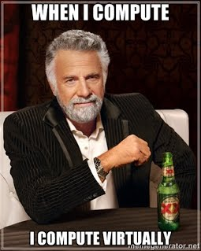

# Protecting CIA from DAD

What is CyberPatriot?  For the official statement of what the CyberPatriot is, the website at http://uscyberpatriot.org/ states:

    WHAT IS CYBERPATRIOT?  CyberPatriot is the National Youth Cyber Education Program.  CyberPatriot was conceived by the Air Force Association (AFA) to inspire high school students toward careers in cybersecurity or other science, technology, engineering, and mathematics (STEM) disciplines critical to our nation's future.

In CyberPatriot, the cadets learn topics that include general security, virtualization, patching, anti-virus, services, firewalls, malware, and networking.  As time permits, we will dig into vulnerability scanning, information gathering, and scripting.  Training is available for everyone, and the competition team will be Cadets in high school.

What is with some central intelligence and a father figure in the title?  Nothing.  CIA is a core concept of cybersecurity; Confidentiality, Integrity, and Availability.  Cybersecurity is always working to find a balance of those three concepts.  And for the father figure... it is the opposite of CIA.  It is Disclosure, Alteration, and Destruction.

# Confidentiality

As mentioned in the introductory message, the primary principles of cybersecurity are Confidentiality, Integrity, and Availability.

Confidentiality is the principle that most people will associate with cybersecurity.  It is the principle of how to keep my information or objects from being seen or accessed by unwanted or unauthorized people, or disclosing it.  Stuff that is commonly protected include bank accounts.

The primary methods to protect the information include controlling access to the information and encoding the information in only a way that you can decode it with cryptography.

If I did not want you to read a document, I could put the document on a flash drive, drop the drive into a safe, fill the safe with cement, lock it, and drop it in a undisclosed location in the ocean.  If that was done, you most likely would not be able to read the document.  Even if you found the safe, the flash drive would most likely be destroyed.  This is an extreme method of controlling access to the document.

Encoding a document is like the replacement codes where you replace one letter with another letter, and only the authorized people know which letters to replace with.  This can be as simple as each letter is replaced with a letter that is rotated 13 characters away (rot13), or even more complex than running several mathematical equations on a block of characters.  An example, the answer the the best way to fix computers is below:

    Unir lbh gevrq gheavat vg bss naq ba ntnva?

What are some items that you, or someone else, use every day that will keep stuff confidential?

# Integrity

The second principle of cybersecurity is integrity.  This is the preservation of the data and guarantee that data that goes into the system comes out intact, and stays true, without alteration.

Access control remains as a core method to maintain integrity.

Encryption is also use, but in a method to create a unique value based on the contents of the data, that can be compared as you move the data around.  This is a concept we will use directly when downloading file for CyberPatriot.

One of the main methods of integrity is backup and recovery.  By maintaining periodic backups, you are able to recover the information.  Many people keep their important information on a flash drive, with out making copies of the flash drive.  One day they pull the flash drive out of the USB port a bit too quick, and off comes the duck bill, and no long have access to the important information.

So how is integrity attacked?  There are two examples I can think of off the top of my head:

* Website defacement is on the top of the list.  People with malicious that want to be known or make a political statement, will attack popular websites and change the content of the front page.  Two popular groups that known for defacing websites are Anonymous and the Syrian Electronic Army.
* Straight from Hollywood, changing grades at school to get a better grade.  Even way back in 1983... [War Games 1983 School Hack.](https://www.youtube.com/embed/O77v7lVKgNU)

Can you think of any other examples of data alteration that must be protected against?

# Availability

And for the principle of cybersecurity that most people may not think about when talking about security... availability.  With out availability to data and information, there is no purpose for the data.  If the data gets destroyed, money and knowledge is lost.  Availability makes sure we can get access to the data, whether there are power failures or flooded networks.

From the discussion on confidentiality, locking a flash drive in a safe with cement will destroy the availability to the data.  Access control is still a key method to protect availability, but will make sure the good subjects can get access to the data while keeping out the bad.  A popular attack on availability are denial of services (DoS) attacks that will overwhelm websites to the point of shutting them down, or not allowing anyone else to get to them.

As with integrity, backups and restores also serve as a strong method to protect availability.  If data gets destroyed, it can be restored to a prior point in time.  Redundancy, or having multiple parts servicing a single purpose, is another main method to maintain availability.  Many business systems have multiple hard drives in servers, so that if a single hard drive fails, the server continues to operate.

Examples of attacks on availability include:

- Denial of service attacks on websites to shut them down.
- Crypto locker malware that will lock people out of their computers, encrypt files, and extort money from them to restore the files.

Can you think of other incidents that can happen to affect availability to information?

# How do you google

Taking a step away from security specific topics, lets talk a bit on searching the internet.

The meme is a good one that doesn't hit too far from the truth.  When people come to me with issues on computers, there are times I may know the answers, but many times I do not.  Knowing how to find an answer when you do not know the answer is an important skill.

Some good tips for searching the internet can be found in this article: [10 tips for smarter, more efficient Internet searching](http://www.techrepublic.com/blog/10-things/10-tips-for-smarter-more-efficient-internet-searching/)

* Use unique, specific terms
* Use the minus operator (-) to narrow the search
* Use quotation marks for exact phrases
* Don't use common words and punctuation
* Capitalization
* Drop the suffixes
* Maximize AutoComplete
* Customize your searches
* Use browser history
* Set a time limit — then change tactics

I'm not trying to say that internet searching will make you a computer guru.  With the knowledge you have, and the knowledge you gain through programs like CyberPatriot, you will be able to improve your search ability, and help people with finding answers to their computer issues.  While searching for answers, you may also learn something.

# Virtualization

Virtualization is the ability to run a computer inside another computer.  From a security perspective, there are many benefits of doing this, most notable the ability to sandbox, or isolate, a system that may be vulnerable or compromised.  CyberPatriot uses virtualization in the competitions so that we can compete on compromised systems with out affecting our real systems.

To start with virtualization, you need an application that acts as a hypervisor, or a bridge between the virtual computer resources and the physical resources.  The 2 main applications are VMWare and VirtualBox.

VMWare Player is a free solution that will allow the running of pre-built virtual machines, called guests, on your computer, called the host.  The CyberPatriot competition images are built for VMWare Player.

* Download and install VMWare Workstation Player from https://www.vmware.com/products/player/playerpro-evaluation.html
* Find an image from a website such as OS Boxes to download - http://www.osboxes.org/vmware-images/
* Launch VMWare Player and open the OS image that was downloaded.
* Virtually boot your new computer in a computer.

What you should see is a window that opens, which looks like the desktop of your guest.  You can browse the web, run applications, and even may be able to play some games on the guest.  And when you are done, the guest can be shutdown, like your desktop/laptop can be shutdown.

Many virtual machines that are offered for free on the internet are Linux, or other free operating systems such as Android.  Windows will also run in virtual machines, but due to licensing of the OS, they are not available for free download.

Some uses of virtualization include:

* Test a new operating system or application.
* Run an application that you do not know how it affects your main computer.
* Run an application without messing up your main computer.
* Run an application that requires a special configuration.
* Learn how to install an operating system.

One downside to virtualization is that performance of the guest will be decreased due to not having native access to the hosts hardware.

To give virtualization a try, you can follow the example directions on the US CyberPatriot web site at http://uscyberpatriot.org/competition/training-materials/linux.

# Password and Password Managers

Passwords may not be the best form of security, but due to the ease of use, they tend to be the most widely used.  Creating good passwords can be a skill.

The rules of a good password use include:
* Always contain at least 3 of the following:
  * Uppercase letters
  * Lowercase letters
  * Numbers
  * Symbols (!@#$%^...)
* Always use at least 8 characters (key presses)
* Never share a password.
* Do not use dictionary words.
* Do not use personal or public information, such as names.
* Do not  use the same password for different systems.
* Change passwords periodically.

A good method for creating passwords is to find 2 words, combine with a symbol, and replace some of the characters with numbers and symbols.  For example:

**F1uffy#3leph@nt**

The rule of 'Do not use the same password for different systems' can make remembering all your passwords hard.  In this case many people use what is called a password manager.  Password managers is a vault that you can store your passwords in, and use a single master password to access.  This can increase your security by allowing you to create different passwords on each system with out having to write them down or memorize each one.  But it can also make it less secure because that one master password must be secure and confidential.

# Getting Started with VM

If you have a computer, with a 64-bit processor in it, and at least 2 GB of RAM, you should be able to work with a CyberPatriot image.

To check to see if you have a 64-bit computer and memory, you can do the following:

* Open System by clicking the Start button Picture of the Start button, right-clicking Computer, and then clicking Properties.
* In the System section, you can view the system type to see if it is 64-bit or 32-bit.
* In the System section, next to Installed memory (RAM), you can see the amount of RAM your computer has.

To be able to play with a CyberPatriot image, start out by downloading and Installing the VMWare Player software.  This software is considered a hypervisor, and will allow the virtual image to act like a virtual computer.

Once you have the hypervisor installed, you need an image to be able to work with.  Due to licensing requirements, we will use a CyberPatriot Ubuntu practice image.  Visit the page at https://www.uscyberpatriot.org/competition/training-materials/practice-images, and download one of the images near the bottom of the page.  Take note of the username and password on the page.

After the practice image is downloaded, you will have to unzip the image by right clicking on the icon, select 'Extract all..', and follow the prompts to extract the zip file.

Now the fun part, as illustrated in the last slide at https://s3.amazonaws.com/cpvii/Training+materials/Unit+Three+-+Computer+Basics+and+Virtual+Machines.pdf:

1. Start your newly installed VMWare Player software
- Click “Open a Virtual Machine”
- Browse for and open the .vmx file in the image folder you downloaded
- Click “Play virtual machine”
- Select “I copied it”
- Click “OK” on Removable Devices pop-up

You will now have a virtual linux computer that you can play with.  There are virtual power buttons, virtual ctrl-alt-del, and virtual shutdown processes.  One of the benefits of using a virtual computer is that you can play with it, and if you break something in the virtual computer, all you have to do is re-unzip the image, and restart.

This is a very high level overview of starting a virtual machine, but with some playing, you should be able to play with virtualization and ubuntu.

One last thing to note.... I consider this playing, and not working.  It is fun when you start playing with virtual machines and find out what you can do on a computer while you have a safety net of a restore that you can fall on to.

# Malware Tools

With all of the talk of cloud computing, smart phones and tables, and internet of things, desktop malware scanning started fading into the trees.  Yet with a current headline, malware scanning is as important as ever, and will spread to to all the things.

[Study: Twelve new malware strains created per minute during first half of 2015](http://www.scmagazine.com/g-data-software-issues-biannual-report/article/448883/)

There are a number of different malware types out there, and different tools can address some better than others.  The tools we are focusing on for this article are for anti-virus, spyware/crapware, and root kits.

One of the staples of malware is viruses.  A virus is distinguished by a piece of malicious software that will attach itself to other files and executables, or simulate valid executable, and will be activated when the file is executed.  Viruses can propagate through worms, infected removable media, or social engineering attacks like phishing.  To mitigate virus threats, it is best to have an up-to-date virus scanning software on your system.  Make sure that only one is installed and active, as multiple virus scanners can actually hinder your system.  Some product links below:

* [Kaspersky Labs](http://usa.kaspersky.com/)
* [Norton AntiVirus](http://us.norton.com/antivirus/)
* [TrendMicro Antivirus + Security](http://www.trendmicro.com/us/home/products/software/antivirus-plus-security/)
* [McAfee AntiVirus Basic](https://www.mcafee.com/consumer/en-us/store/m0/catalog/mavb_511/mcafee-antivirus-basic.html)

If you want to test if you have some antivirus software, you can (try to) download a test virus file from EICAR: [EICAR Test File](http://www.eicar.org/86-0-Intended-use.html)

The majority of items tend to be less malicious, and considered spyware or crapware.  These tend to be registry settings, potentially unwanted programs, cookies, or other nuggets of data to track what you do and slow down your system.  For these type of malware, the defacto standard scanner is MalwareBytes.  If MalwareBytes does not take care of it, Hijack This can be used to look deeper to see if you can determine what may be cause an issue.  With these type of scanners, you want to scan, clean, repeat until the unwanted items are gone.

* [MalwareBytes](https://www.malwarebytes.org/mwb-download/)
* [HiJack This](http://sourceforge.net/projects/hjt/)

Finally, there can be a form of malware that is intelligent enough to hide itself from most other scanners.  These are call Root Kits, and can be particularly nasty and may require special tools to clean them off.

* [RootKit Buster](http://files.trendmicro.com/products/rootkitbuster/x64/RootkitBusterV5.0-1198x64.exe)

As we get more advanced, and start knowing what normal looks like on our computers, we can used the advanced tools below to dig deeper into our systems:

* [Sysinternals Process Explorer](https://technet.microsoft.com/en-us/sysinternals/bb896653)
* [Sysinternals TCP View](https://technet.microsoft.com/en-us/sysinternals/bb897437)

So, in an instance where a relative or acquaintance comes to you for malware help, I'd recommend the following process:

1. Remove any programs that are not required or look suspicious from Add/Remove Programs or Features in the Control Panel.  If you do not know what a program is, use your Google-Fu to find out what it is.
- Install, update, and run MalwareBytes to clean off the spyware and crapware settings.  Scan, clean, repeat until the majority of the items are gone.
- Update and scan the computer with the installed anti-virus software.  If one is not installed, install one.  If more than one is installed, remove the ones that are free or unlicensed (unless the free one is the main one.)  Scan, clean, repeat until the virus is gone.
- If a virus is identified but not cleaned, use your Google-Fu to find out more information on it.  Many times, there may be a special removal procedure that you can follow.
- If the system is still acting funny, there may be a root kit, in which you would require a root kit buster/killer to clean.
- Finally, booting off a rescue CD and scanning the system using something like the Kaspersky Rescue CD may be a solution.
- If nothing else, punt... through some up rights and into a lake. :)

# What Does Secure Look Like

Ever wonder what secure looks like, or can be like, especially for people new to cyber security.  There are some organizations that attempt to standardize and guide people in what secure looks like.  One such organization that I'd like to point out is Center for Internet Security, and more focused on the documents they offer to help you secure a computer.

Lets look at securing Windows 7.  You can start by visiting the Benchmarks Download page and download the benchmark for your OS.  Each benchmark will provide a detailed list of items that can be done to secure a system, the reason why the item is considered for security, how to check the item, and how to fix the item.

An example from the Windows 7 Benchmark that we covered is password policy.  When I found minimum length of a password in the benchmark, it showed the following..

Farther down in the document, it gave the instructions on how to set the minimum password length to 14...

This gives the full path in the Group Policy tool to find the setting and update to the recommended value of 14.

As you would go through the document, many settings would be addressed.  Going through the full document on a competition image would be over kill, but having it available, and searching for key terms in the competition scenario may help direct you in what needs to be changed and how to change it.

The Windows 7 document is quite lengthy and complex, at 420 pages, yet does provide value to search for settings to secure and locations.  The Ubuntu 12.04 benchmarks tend to be a bit more straight forward, and weights in at only 160 pages.

I recommend that you familiarize yourself with the documents to use as a reference for competitions, or just to secure your home computer.
